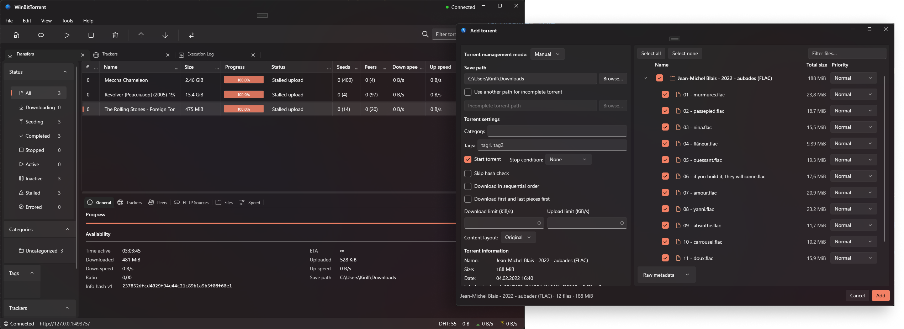
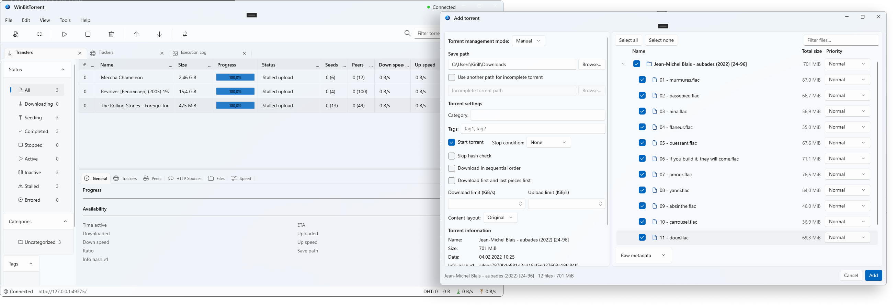

<div align="center">


# WinBitTorrent

**A native WinUI 3 desktop client for qBittorrent on Windows.**

WinBitTorrent wraps the real `qbittorrent-nox` engine in a modern, fluent Windows 11 interface — Mica backdrop, light/dark themes, tabbed details, drag-and-drop, tray integration and full localization — while keeping the proven qBittorrent/libtorrent core running under the hood.

[](https://www.microsoft.com/windows)
[](https://dotnet.microsoft.com/)
[](https://learn.microsoft.com/windows/apps/windows-app-sdk/)
[](https://www.qbittorrent.org/)
[](LICENSE)

</div>

---

## Screenshots

<div align="center">

**Dark theme**



**Light theme**



</div>

---

## Table of contents

- [What is WinBitTorrent?](#what-is-winbittorrent)
- [Features](#features)
- [How it works (under the hood)](#how-it-works-under-the-hood)
- [Tech stack](#tech-stack)
- [Download & install](#download--install)
- [Building from source](#building-from-source)
- [Data & configuration locations](#data--configuration-locations)
- [Security notes](#security-notes)
- [Localization](#localization)
- [Contributing](#contributing)
- [License](#license)
- [Third-party notices & source offer](#third-party-notices--source-offer)
- [Acknowledgements](#acknowledgements)

---

## What is WinBitTorrent?

qBittorrent is a fantastic, cross-platform BitTorrent client, but its desktop UI is built on Qt Widgets and doesn't feel at home on modern Windows. **WinBitTorrent is a from-scratch Windows front-end** that speaks to qBittorrent's Web API and renders everything with **WinUI 3 / the Windows App SDK**.

Out of the box it ships and **manages its own bundled `qbittorrent-nox` engine** as a private, loopback-only background process — so it works as a standalone torrent client with no manual server setup. It can *also* connect to any **remote qBittorrent instance** (a NAS, a seedbox, a home server) using username/password or an API key.

You get the reliability of the qBittorrent + libtorrent core with a UI that matches Windows 11.

---

## Features

### Torrents & transfers
- **Transfer list** with sortable, reorderable, show/hide columns (queue #, name, size, progress, status, seeds/peers, speeds, ETA, ratio, category, tags, added/completed dates, save path, info hashes, and more).
- **Add torrents** from `.torrent` files, magnet links or URLs, with a rich pre-add dialog: save path & separate incomplete path, category/tags, start paused, skip-hash-check, sequential download, first-and-last-piece priority, download/upload limits, content layout and stop condition.
- **Per-file selection & priority** in an interactive file tree (Do not download / Normal / High / Maximum), with tri-state folder checkboxes.
- **Detail tabs** for the selected torrent: General, Trackers, Peers (with per-peer country flags), HTTP Sources, Files and a live Speed graph.
- **Full context-menu actions**: start/stop/force-start, force recheck, reannounce, queue up/down/top/bottom, set category, add/remove tags, rate limits, share-ratio limits, rename, set location, add trackers & web seeds, export `.torrent`, super-seeding, open destination folder (with the file selected in Explorer), preview, and delete (optionally with data).

### Discovery
- **RSS reader** with auto-download rules.
- **Search engine** powered by qBittorrent's bundled Python (`nova3`) search plugins.
- **Tracker search** with a built-in **RuTracker** provider, including optional proxy support and secure credential storage.

### Tools & UX
- **Create torrent** wizard, **cookies manager**, and **statistics** view.
- **Server profiles** — the managed local engine plus any number of remote qBittorrent servers.
- **Options** across eight categories (Behavior, Downloads, Connection, Speed, BitTorrent, WebUI, RSS, Advanced) that read/write real qBittorrent preferences and verify they were applied.
- **Windows-native niceties**: Mica backdrop, custom title bar, **light/dark/system theme**, **system tray** icon with quick actions, **drag-and-drop** of `.torrent` files, `.torrent` **file association** and **`magnet:` protocol** handling, single-instance activation, and persistent window/tab/column layout.
- **Localization**: English (`en-US`), Russian (`ru-RU`) and Belarusian (`be-BY`).

---

## How it works (under the hood)

WinBitTorrent does **not** re-implement the BitTorrent protocol. Instead it drives the genuine qBittorrent engine over its documented Web API:

```
┌──────────────────────────────────────────────┐
│  WinBitTorrent (WinUI 3 desktop app, .NET 8)  │
│  Views / ViewModels (MVVM)                     │
│            │  HTTP + API key (localhost)        │
│            ▼                                    │
│  QbittorrentApi client  ── Web API 2.15.1 ──┐  │
└──────────────────────────────────────────────┘
             │                                 │
             ▼ (managed local profile)         ▼ (remote profile)
   ┌───────────────────────────┐     ┌───────────────────────────┐
   │  Bundled qbittorrent-nox  │     │  Any remote qBittorrent    │
   │  5.2.3 + libtorrent 2.0.x │     │  server (NAS / seedbox)    │
   │  child process, 127.0.0.1 │     └───────────────────────────┘
   └───────────────────────────┘
```

**Managed local backend.** On first launch of the local profile, the app spawns the bundled `qbittorrent-nox.exe` with a private profile directory, binds its Web UI to `127.0.0.1` on a random free port, and boots it headless. It reads the one-time temporary admin password from the engine's output, immediately **rotates it into a persistent API key**, and stores that key in the **Windows Credential vault** (`PasswordVault`) — the password never touches disk and is redacted from logs. The engine version and Web API version are verified against the expected contract (`5.2.3` / `2.15.1`) on startup.

**Lifecycle safety.** The child process is attached to a Windows **Job object**, so the engine can never be orphaned — if the app crashes or is killed, the backend goes down with it. On unexpected exit, WinBitTorrent attempts a bounded automatic restart.

**Remote mode.** Point a profile at any reachable qBittorrent Web UI and authenticate with username/password or an API key. The same UI drives local and remote servers; features that require local disk access (e.g. *Open destination folder*) are automatically limited to the managed local engine.

---

## Tech stack

| Area | Technology |
|------|------------|
| UI framework | **WinUI 3** via the **Windows App SDK 2.2** (self-contained) |
| Runtime | **.NET 8** (`net8.0-windows10.0.19041.0`), x64 |
| App architecture | **MVVM** (CommunityToolkit.Mvvm) + `Microsoft.Extensions.DependencyInjection` |
| Data grid | WinUI.TableView |
| Torrent engine | **qBittorrent 5.2.3** (`qbittorrent-nox`) / **libtorrent 2.0.13** / Qt 6.11 / Boost 1.91 / OpenSSL 3.6 / CPython 3.13 |
| Tests | xUnit, FlaUI (UI automation) |

The solution is split into three projects for a clean separation of concerns:

- **`WinBitTorrent`** — the WinUI 3 app: windows, views, view models, converters, services (settings, localization, tray).
- **`WinBitTorrent.Core`** — pure .NET domain layer: models, abstractions, and framework-free services (filters, formatters, preference verification, main-data accumulation). No UI or platform dependencies.
- **`WinBitTorrent.Infrastructure`** — the plumbing: the managed backend host, the Web API client, credential/profile storage, and tracker providers.

---

## Download & install

> **Requirements:** Windows 10 version 2004 (build 19041) or newer, 64-bit.

1. Go to the [**Releases**](https://github.com/Gorbachevvv/winBitTorrent/releases) page.
2. Download the latest build for `win-x64`.
3. Run the installer (or unzip the portable build) and launch **WinBitTorrent**.

The bundled qBittorrent engine is included in the release, so there is nothing else to install — the app is ready to download torrents immediately.

---

## Building from source

### Prerequisites
- **Visual Studio 2022** (17.10+) with the **.NET Desktop** and **Windows App SDK / WinUI** workloads, or the **.NET 8 SDK** with the Windows App SDK.
- Windows 10/11 x64.

### 1. Clone
```bash
git clone https://github.com/Gorbachevvv/winBitTorrent.git
cd winBitTorrent
```

### 2. Provide the native backend
The `Backend/` folder (containing `qbittorrent-nox.exe` and all of its native/Python dependencies) is **not committed** to the repository. You have two options:

- **Download the CI artifact** — the *Windows backend* GitHub Actions workflow builds and publishes `qbittorrent-nox-5.2.3-win-x64` as an artifact. Extract it into `Backend/` at the repo root.
- **Build it yourself** — run the reproducible build script (takes a while; it compiles qBittorrent, libtorrent, Qt, Boost, OpenSSL and Python via a pinned vcpkg baseline):
  ```powershell
  .\build\build-backend.ps1
  ```
  Exact source URLs, versions, SHA-256 hashes and the vcpkg baseline live in [`build/build-backend.ps1`](build/build-backend.ps1) and [`build/vcpkg.json`](build/vcpkg.json).

> You can also point the app at an externally built engine with the `WINBITTORRENT_BACKEND_PATH` environment variable.

### 3. Build & run
```bash
dotnet build WinBitTorrent.csproj -c Debug -p:Platform=x64
```
Or open `WinBitTorrent.slnx` in Visual Studio, set the platform to **x64**, and press **F5**.

### 4. Run the tests
```bash
dotnet test
```
The solution includes unit tests (`WinBitTorrent.Core.Tests`, `WinBitTorrent.Infrastructure.Tests`), integration tests against the managed backend (`WinBitTorrent.IntegrationTests`), and FlaUI-driven UI tests (`WinBitTorrent.UiTests`).

---

## Data & configuration locations

All runtime data lives under `%LOCALAPPDATA%\WinBitTorrent` (overridable with the `WINBITTORRENT_DATA_ROOT` environment variable):

| Path | Contents |
|------|----------|
| `client-settings.json` | UI preferences: theme, language, layout, tab state, confirmations |
| `profiles.json` | Server profiles (local + remote) |
| `Backend\Profile\` | The managed qBittorrent engine's private profile, config and data |
| `Backend\host.json` | Persisted loopback port for the managed engine |
| `Logs\` | Application logs |

Secrets (the local API key and tracker credentials) are stored in the **Windows Credential vault**, not in these files.

---

## Security notes

- The managed engine's Web UI is bound to **`127.0.0.1` only**, with **host-header validation** enabled and server domains restricted to `localhost`.
- The port is chosen randomly per machine and is never exposed externally.
- Authentication uses a **rotated API key** kept in the Windows Credential vault; the qBittorrent one-time temporary password is consumed at startup, **redacted from logs**, and never persisted.
- The native engine runs inside a **Windows Job object** so it cannot outlive the app.

---

## Localization

WinBitTorrent ships with **English** (`en-US`), **Russian** (`ru-RU`) and **Belarusian** (`be-BY`) resources under `Strings/`. The language can be changed in **Tools → Options → Behavior** and applies on the next launch. Contributions of additional languages are welcome — add a `Strings/<culture>/Resources.resw` alongside the existing ones.

The **Belarusian** translation was kindly contributed by [**@saivan4ick**](https://github.com/saivan4ick).

---

## Contributing

Issues and pull requests are welcome!

- Found a bug or have a feature request? [Open an issue](https://github.com/Gorbachevvv/winBitTorrent/issues).
- Keep changes focused, match the existing code style, and make sure `dotnet build` and `dotnet test` pass.
- UI strings should go through the `.resw` resource files (both cultures) rather than being hard-coded.

---

## License

WinBitTorrent's own source code is licensed under the **GNU General Public License v3.0 or later (GPL-3.0-or-later)** — see [`LICENSE`](LICENSE).

This project **bundles and distributes** the qBittorrent engine, which is itself licensed under GPL-2.0-or-later (source) / GPL-3.0-or-later (binary, with the project's OpenSSL exception). Distributing the combined work under GPL-3.0-or-later keeps everything license-compatible.

---

## Third-party notices & source offer

WinBitTorrent stands on the shoulders of excellent open-source projects. Full notices are in [`Licenses/THIRD-PARTY-NOTICES.txt`](Licenses/THIRD-PARTY-NOTICES.txt), and the complete corresponding-source offer for the bundled GPL backend is in [`build/SOURCE-OFFER.txt`](build/SOURCE-OFFER.txt).

| Component | Version | License |
|-----------|---------|---------|
| [qBittorrent](https://github.com/qbittorrent/qBittorrent) | 5.2.3 | GPL-2.0-or-later / GPL-3.0-or-later (binary) |
| [libtorrent](https://github.com/arvidn/libtorrent) | 2.0.13 | BSD 3-Clause |
| [Qt](https://www.qt.io/) | 6.11.1 | LGPL-3.0 / GPL |
| [Boost](https://www.boost.org/) | 1.91.0 | Boost Software License 1.0 |
| [OpenSSL](https://www.openssl.org/) | 3.6.2 | Apache-2.0 |
| [CPython](https://www.python.org/) | 3.13.14 | PSF License |
| [WinUI.TableView](https://github.com/w-ahmad/WinUI.TableView) | 1.4.1 | MIT |
| [CommunityToolkit.Mvvm](https://github.com/CommunityToolkit/dotnet) | 8.4.0 | MIT |
| [DB-IP IP-to-Country Lite](https://db-ip.com/) | 2026-07 | CC BY 4.0 |
| [flagcdn country flags](https://flagcdn.com/) | — | Public domain |

The bundled `qbittorrent-nox.exe` is built **without source modifications** from the official qBittorrent `release-5.2.3` tag. The build recipe in `build/` serves as the durable written offer for the corresponding source.

Peer-country resolution uses the free **IP-to-Country Lite** database by [**DB-IP**](https://db-ip.com/) (`Backend/GeoDB/dbip-country-lite.mmdb`), licensed under [CC BY 4.0](https://creativecommons.org/licenses/by/4.0/). Country flag icons in the Peers tab are public-domain images from [flagcdn](https://flagcdn.com/).

---

## Acknowledgements

- The [**qBittorrent**](https://www.qbittorrent.org/) team and contributors for the engine that powers this client.
- [**Arvid Norberg**](https://github.com/arvidn/libtorrent) and the libtorrent project.
- Microsoft's [**Windows App SDK / WinUI**](https://learn.microsoft.com/windows/apps/windows-app-sdk/) and [**.NET**](https://dotnet.microsoft.com/) teams.
- [**@saivan4ick**](https://github.com/saivan4ick) for the **Belarusian** translation.
- [**DB-IP**](https://db-ip.com/) for the free IP-to-Country Lite database, and [**flagcdn**](https://flagcdn.com/) for the public-domain flag icons, used to show peer countries.

<div align="center">

**WinBitTorrent** is an independent project and is not affiliated with or endorsed by the qBittorrent project.

</div>
