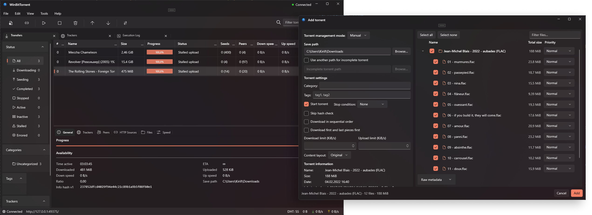
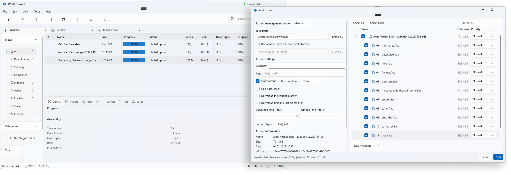

<div align="center">


# [WinBitTorrent](https://winbittorrent.github.io/)

**A native WinUI 3 BitTorrent client for Windows.**

WinBitTorrent combines a modern Windows 11 interface with its own local engine powered directly by libtorrent 2.0.13. The local path uses a protected named pipe—there is no local Web UI process, qBittorrent or Qt dependency. Remote qBittorrent profiles remain supported through Web API 2.15.1.

[](https://www.microsoft.com/windows)
[](https://dotnet.microsoft.com/)
[](https://learn.microsoft.com/windows/apps/windows-app-sdk/)
[](https://www.libtorrent.org/)
[](LICENSE)

</div>

---

## Screenshots

<div align="center">

**Dark theme**



**Light theme**



</div>

---

## Table of contents

- [What is WinBitTorrent?](#what-is-winbittorrent)
- [Features](#features)
- [How it works (under the hood)](#how-it-works-under-the-hood)
- [Tech stack](#tech-stack)
- [Download & install](#download--install)
- [Building from source](#building-from-source)
- [Data & configuration locations](#data--configuration-locations)
- [Security notes](#security-notes)
- [Localization](#localization)
- [Contributing](#contributing)
- [License](#license)
- [Third-party notices & source offer](#third-party-notices--source-offer)
- [Acknowledgements](#acknowledgements)

---

## What is WinBitTorrent?

WinBitTorrent is a complete desktop BitTorrent application built with **WinUI 3 / the Windows App SDK**. Its managed `WinBitTorrent.EngineHost.exe` worker owns local application state, RSS, search, logs and remote access; a narrow native C ABI connects the worker to libtorrent.

The application can also connect to **remote qBittorrent instances** on a NAS, seedbox or home server. Typed backend contracts keep the same UI and user behavior while capability flags hide operations a particular backend cannot perform.

---

## Features

### Torrents & transfers
- **Transfer list** with sortable, reorderable, show/hide columns (queue #, name, size, progress, status, seeds/peers, speeds, ETA, ratio, category, tags, added/completed dates, save path, info hashes, and more).
- **Add torrents** from `.torrent` files, magnet links or URLs, with a rich pre-add dialog: save path & separate incomplete path, category/tags, start paused, skip-hash-check, sequential download, first-and-last-piece priority, download/upload limits, content layout and stop condition.
- **Per-file selection & priority** in an interactive file tree (Do not download / Normal / High / Maximum), with tri-state folder checkboxes.
- **Detail tabs** for the selected torrent: General, Trackers, Peers (with per-peer country flags), HTTP Sources, Files and a live Speed graph.
- **Full context-menu actions**: start/stop/force-start, force recheck, reannounce, queue up/down/top/bottom, set category, add/remove tags, rate limits, share-ratio limits, rename, set location, add trackers & web seeds, export `.torrent`, super-seeding, open destination folder (with the file selected in Explorer), preview, and delete (optionally with data).

### Discovery
- **RSS reader** with auto-download rules.
- **Search engine** powered by bundled Python and qBittorrent-compatible Nova search plugins.
- **Tracker search** with a built-in **RuTracker** provider, including optional proxy support and secure credential storage.

### Tools & UX
- **Create torrent** wizard, **cookies manager**, and **statistics** view.
- **Server profiles** — the native local engine plus any number of remote qBittorrent servers.
- **Options** across eight categories (Behavior, Downloads, Connection, Speed, BitTorrent, Remote API, RSS, Advanced), mapped to the active backend and verified after application.
- **Windows-native niceties**: Mica backdrop, custom title bar, **light/dark/system theme**, **system tray** icon with quick actions, **drag-and-drop** of `.torrent` files, `.torrent` **file association** and **`magnet:` protocol** handling, single-instance activation, and persistent window/tab/column layout.
- **Localization**: English (`en-US`), Russian (`ru-RU`) and Belarusian (`be-BY`).

---

## How it works (under the hood)

WinBitTorrent delegates the BitTorrent wire protocol to libtorrent and owns the surrounding application behavior:

```
┌──────────────────────────────────────────────┐
│  WinBitTorrent (WinUI 3 desktop app, .NET 8) │
│  Views / ViewModels / typed backend contract │
└──────────────────────────────────────────────┘
             │                                 │
             ▼ (local profile)                 ▼ (remote profile)
   ┌───────────────────────────┐     ┌───────────────────────────┐
   │ WinBitTorrent.EngineHost  │     │  RemoteQbittorrentClient  │
   │ .NET 8 + SQLite (WAL)     │     │  Web API 2.15.1 over HTTP │
   │ named pipe + native C ABI │     └───────────────────────────┘
   │ libtorrent 2.0.13         │
   └───────────────────────────┘
```

**Local backend.** The desktop starts `WinBitTorrent.EngineHost.exe` and authenticates a current-user-only named pipe using a random one-time secret delivered through redirected standard input. Commands use a versioned, length-prefixed JSON protocol with correlation IDs. The worker persists state under `%LOCALAPPDATA%\WinBitTorrent\Engine` in SQLite WAL mode and stores resume data in SQLite or `.fastresume` files.

**Lifecycle safety.** The worker is attached to a Windows **Job object**, so it cannot be orphaned if the desktop exits or crashes. The bundled Python helper exists only for the duration of a search job and inherits the same process containment.

**Remote mode.** Point a profile at any reachable qBittorrent Web UI and authenticate with username/password or an API key. Local-only operations such as opening a destination in Explorer are selected through backend capabilities rather than profile-name checks.

---

## Tech stack

| Area | Technology |
|------|------------|
| UI framework | **WinUI 3** via the **Windows App SDK 2.2** (self-contained) |
| Runtime | **.NET 8** (`net8.0-windows10.0.19041.0`), x64 |
| App architecture | **MVVM** (CommunityToolkit.Mvvm) + `Microsoft.Extensions.DependencyInjection` |
| Data grid | WinUI.TableView |
| Torrent engine | **libtorrent 2.0.13**, Boost 1.91, OpenSSL 3.6, CPython 3.13 |
| Local IPC and state | Current-user named pipe, versioned JSON RPC, SQLite WAL |
| Remote compatibility | qBittorrent Web API 2.15.1 adapter |
| Tests | xUnit, FlaUI (UI automation) |

The solution is split into five layers:

- **`WinBitTorrent`** — the WinUI 3 app: windows, views, view models, converters, services (settings, localization, tray).
- **`WinBitTorrent.Core`** — pure .NET domain layer: models, abstractions, and framework-free services (filters, formatters, preference verification, main-data accumulation). No UI or platform dependencies.
- **`WinBitTorrent.Infrastructure`** — EngineHost lifecycle/IPC, remote qBittorrent adapter, credential/profile storage and tracker providers.
- **`WinBitTorrent.EngineHost`** — local application logic, SQLite state, RSS/search/creator/logs and optional `/api/v1` remote access.
- **`WinBitTorrent.Native.dll`** — versioned C ABI that encapsulates libtorrent without leaking C++ objects across the boundary.

---

## Download & install

> **Requirements:** Windows 10 version 2004 (build 19041) or newer, 64-bit.

1. Go to the [**Releases**](https://github.com/Gorbachevvv/winBitTorrent/releases) page.
2. Download the latest build for `win-x64`.
3. Run the installer (or unzip the portable build) and launch **WinBitTorrent**.

EngineHost, libtorrent and the search runtime are bundled, so there is nothing else to install.

---

## Building from source

### Prerequisites
- **Visual Studio 2022** (17.10+) with the **.NET Desktop** and **Windows App SDK / WinUI** workloads, or the **.NET 8 SDK** with the Windows App SDK.
- Windows 10/11 x64.

### 1. Clone
```bash
git clone https://github.com/Gorbachevvv/winBitTorrent.git
cd winBitTorrent
```

### 2. Build the pinned runtime and native engine

Generated native and Python assets are not committed. Build the pinned libtorrent/OpenSSL/Boost runtime, bundled Python/Nova search runtime and native C ABI:

```powershell
.\build\build-runtime.ps1
.\build\build-engine.ps1
```

The source URLs, hashes and versions are pinned in [`build/build-runtime.ps1`](build/build-runtime.ps1) and [`build/runtime/vcpkg.json`](build/runtime/vcpkg.json). The old `build-backend.ps1` remains a development-only qBittorrent oracle for parity testing and is never included in release payloads.

### 3. Build & run
```bash
dotnet build WinBitTorrent.csproj -c Debug -p:Platform=x64
```
Or open `WinBitTorrent.slnx` in Visual Studio, set the platform to **x64**, and press **F5**.

### 4. Run the tests
```bash
dotnet test
```
The solution includes unit tests (`WinBitTorrent.Core.Tests`, `WinBitTorrent.Infrastructure.Tests`), integration tests against the managed backend (`WinBitTorrent.IntegrationTests`), and FlaUI-driven UI tests (`WinBitTorrent.UiTests`).

---

## Data & configuration locations

All runtime data lives under `%LOCALAPPDATA%\WinBitTorrent` (overridable with the `WINBITTORRENT_DATA_ROOT` environment variable):

| Path | Contents |
|------|----------|
| `client-settings.json` | UI preferences: theme, language, layout, tab state, confirmations |
| `profiles.json` | Server profiles (local + remote) |
| `Engine\engine.db` | Versioned local engine state, settings and optional SQLite resume data |
| `Engine\torrents\`, `Engine\resume\` | Metadata and file-mode `.fastresume` state |
| `Engine\Backups\` | Immutable legacy-profile backups with manifests and hashes |
| `Logs\` | Application logs |

Remote profile and tracker credentials are stored in the **Windows Credential vault**. Local Remote API passwords are salted PBKDF2 hashes; bearer API keys are stored only as hashes and shown once when generated.

---

## Security notes

- The desktop's local path never uses HTTP. Its named pipe is restricted to the current Windows user and requires a one-time 256-bit handshake secret that is not placed in process arguments.
- The worker runs inside a **Windows Job object** so it cannot outlive the app.
- The optional WinBitTorrent Remote API is disabled by default (`port = 0`) and defaults to loopback. External bind requires explicit enablement and HTTPS.
- Remote API mutations require bearer authentication or authenticated cookies with CSRF protection. Passwords and API keys are never logged in plaintext.

---

## Localization

WinBitTorrent ships with **English** (`en-US`), **Russian** (`ru-RU`) and **Belarusian** (`be-BY`) resources under `Strings/`. The language can be changed in **Tools → Options → Behavior** and applies on the next launch. Contributions of additional languages are welcome — add a `Strings/<culture>/Resources.resw` alongside the existing ones.

The **Belarusian** translation was kindly contributed by [**@saivan4ick**](https://github.com/saivan4ick).

---

## Contributing

Issues and pull requests are welcome!

- Found a bug or have a feature request? [Open an issue](https://github.com/Gorbachevvv/winBitTorrent/issues).
- Keep changes focused, match the existing code style, and make sure `dotnet build` and `dotnet test` pass.
- UI strings should go through the `.resw` resource files (both cultures) rather than being hard-coded.

---

## License

WinBitTorrent's own source code is licensed under the **GNU General Public License v3.0 or later (GPL-3.0-or-later)** — see [`LICENSE`](LICENSE).

Release packages bundle libtorrent, Boost, OpenSSL and CPython. They do **not** contain qBittorrent or Qt. Remote qBittorrent support is implemented as an HTTP client adapter.

---

## Third-party notices & source offer

WinBitTorrent stands on the shoulders of excellent open-source projects. Full notices are in [`Licenses/THIRD-PARTY-NOTICES.txt`](Licenses/THIRD-PARTY-NOTICES.txt), and reproducible source information for the bundled native runtime is in [`build/SOURCE-OFFER.txt`](build/SOURCE-OFFER.txt).

| Component | Version | License |
|-----------|---------|---------|
| [libtorrent](https://github.com/arvidn/libtorrent) | 2.0.13 | BSD 3-Clause |
| [Boost](https://www.boost.org/) | 1.91.0 | Boost Software License 1.0 |
| [OpenSSL](https://www.openssl.org/) | 3.6.2 | Apache-2.0 |
| [CPython](https://www.python.org/) | 3.13.14 | PSF License |
| [WinUI.TableView](https://github.com/w-ahmad/WinUI.TableView) | 1.4.1 | MIT |
| [CommunityToolkit.Mvvm](https://github.com/CommunityToolkit/dotnet) | 8.4.0 | MIT |
| [DB-IP IP-to-Country Lite](https://db-ip.com/) | 2026-07 | CC BY 4.0 |
| [flagcdn country flags](https://flagcdn.com/) | — | Public domain |

The build recipe pins and records the corresponding native sources used by `WinBitTorrent.Native.dll`. qBittorrent's Nova Python sources are used only for the compatible search helper; no qBittorrent executable or Qt library is distributed.

Peer-country resolution uses the free **IP-to-Country Lite** database by [**DB-IP**](https://db-ip.com/) (`Backend/GeoDB/dbip-country-lite.mmdb`), licensed under [CC BY 4.0](https://creativecommons.org/licenses/by/4.0/). Country flag icons in the Peers tab are public-domain images from [flagcdn](https://flagcdn.com/).

---

## Acknowledgements

- The [**qBittorrent**](https://www.qbittorrent.org/) team and contributors for the Web API and Nova search ecosystem used by remote/compatibility adapters.
- [**Arvid Norberg**](https://github.com/arvidn/libtorrent) and the libtorrent project.
- Microsoft's [**Windows App SDK / WinUI**](https://learn.microsoft.com/windows/apps/windows-app-sdk/) and [**.NET**](https://dotnet.microsoft.com/) teams.
- [**@saivan4ick**](https://github.com/saivan4ick) for the **Belarusian** translation.
- [**DB-IP**](https://db-ip.com/) for the free IP-to-Country Lite database, and [**flagcdn**](https://flagcdn.com/) for the public-domain flag icons, used to show peer countries.

<div align="center">

**WinBitTorrent** is an independent project and is not affiliated with or endorsed by the qBittorrent or libtorrent projects.

</div>
